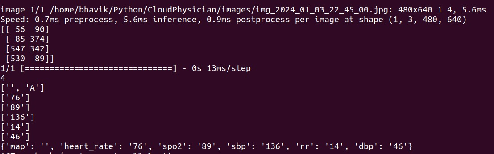

# Cloudphysician
Read [this document](./static/project-proposal.pdf) for the motivation to make this project. 

## Dependencies
- **Python3**: Ensure that you have Python 3 installed on your system. You can download and install Python 3 from the official Python website: https://www.python.org.
- **pip**: pip is the package installer for Python. It is usually installed by default when you install Python. However, make sure you have pip installed and it is up to date. You can check the version of pip by running the following command:
  ```
  pip --version
  ```
## Installation
To install and use Cloudphysician, follow the steps given below:
- Fork the Cloudphysician repository by clicking the "Fork" button at the top right corner of the repository page. This will create a copy of the repository under your GitHub account.
- Clone the forked repository to your local machine:
    ```
    git clone https://github.com/{YOUR-USERNAME}/Cloudphysician
    ```
- Navigate to the project directory: 
    ```
    cd Cloudphysician
    ```
- Install the necessary Python packages by running the following command:
  ```
  pip install -r requirements.txt
  ```
(NOTE: It is recommended to install these requirements in a new python environment)

## How to use?

Follow the steps given below:


## Output
### Input Image


### Result


## Future Developement


## Contributions
Contributions to Cloudphysician are welcome! If you encounter any issues or have suggestions for improvements, please feel free to open an issue or submit a pull request on the GitHub repository.

## Author
[Abhishek Singh Kushwaha](https://github.com/ASK-03)

[Kriti Gupta](https://github.com/Kriti1106)

[Bhavik Shangari](https://github.com/BhavikShangari)